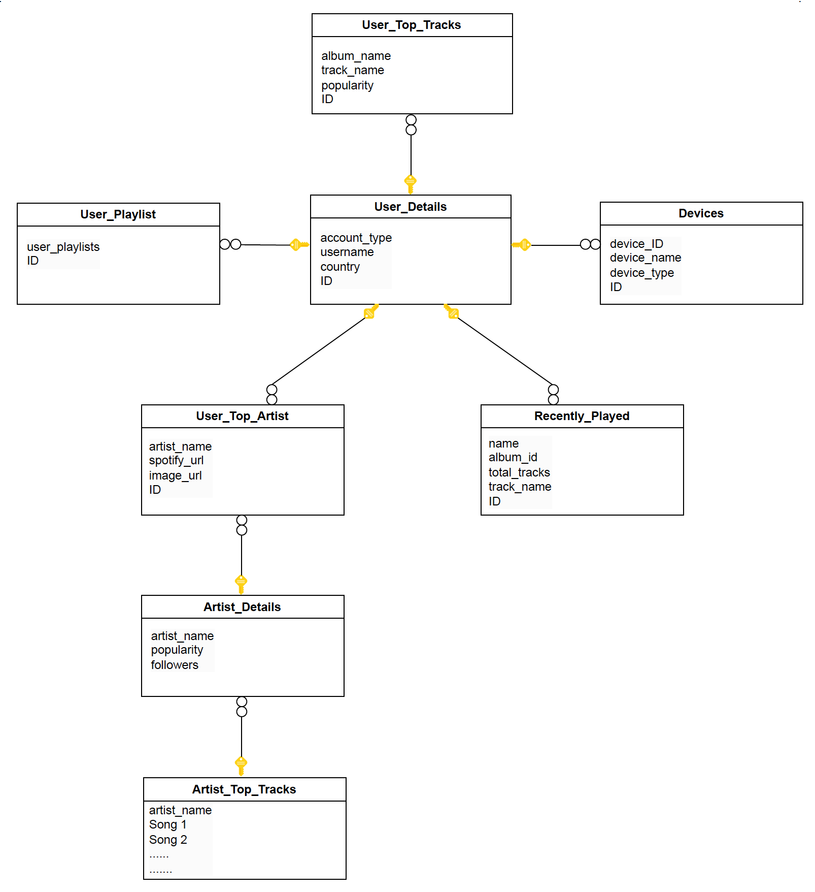
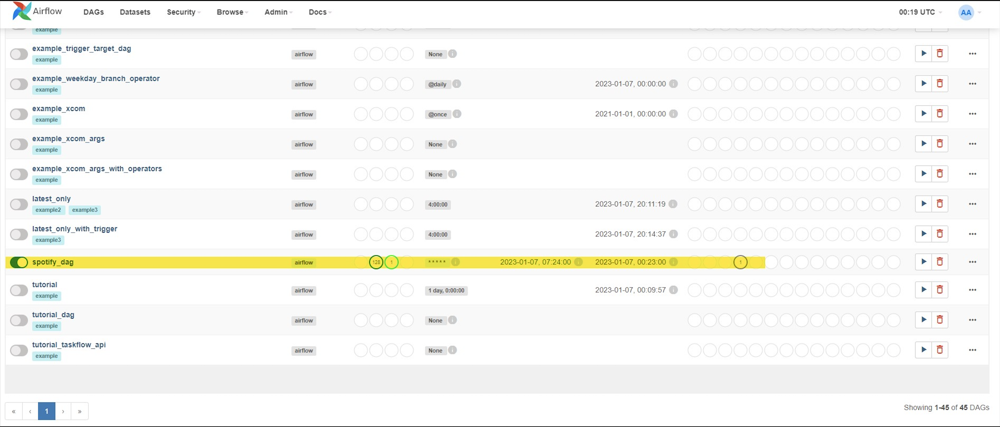
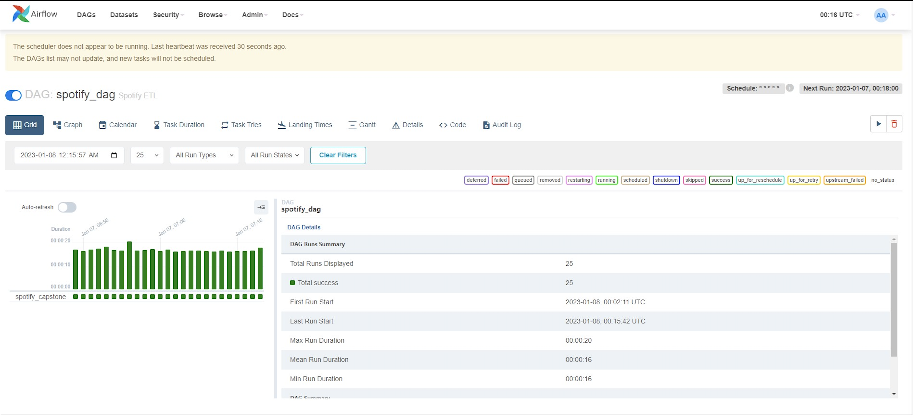

# spotify-api-data-analysis

About a decade ago, the term "data engineering" emerged in forward-thinking companies like Facebook, Netflix, LinkedIn, and Airbnb, driven by their need to manage vast amounts of real-time data efficiently. To cope, engineers at these firms crafted custom tools and platforms for handling data swiftly, reliably, and at scale, moving away from traditional ETL tools.

So, Apache Airflow was used to create an ETL pipeline from the Spotify API, focusing primarily on user activity analysis. The approach involved extracting data from Spotify accounts via the Spotipy API, storing it in SQL Server Management Studio using the Snowflake Schema method. Next, we connected this database to PowerBI to build analytical dashboards. Finally, we managed scheduling using Apache Airflow, crafting a comprehensive on-premise solution.

## Directory Structure
```
├── PowerBI-reports/              <- Contains PowerBI report files.
│   └── spotifyuserdashboard.pbix <- PowerBI report file for Spotify user dashboard.
├── README.md                     <- Top-level README file providing an overview of the project.
├── airflow_etl.py                <- Script for the Airflow Extract, Transform, and Load (ETL) process.
├── main.py                       <- Main application script.
├── sql-server-database/          <- Contains SQL Server database files.
│   └── spotify_analysis.mdf      <- SQL Server database file for Spotify analysis.
├── sql_functions.py              <- Script containing SQL functions.
└── ss/                           <- Contains screenshots or images related to the project.
    ├── airflow-dag-homepage.png  <- Screenshot of Airflow Directed Acyclic Graph (DAG) homepage.
    ├── airflow-grid-view.png     <- Screenshot of Airflow grid view.
    └── architecture.png          <- Image depicting project architecture.
```

## Architecture


Data was extracted out of the Spotify API using API endpoint to get the 25 most recently played tracks. The result of calling this endpoint is a dictionary which will be taken and created into multiple dataframes after cleaning it. SSMS cannot be directly connected from Python using SQLalchemy library.

Once the necessary libraries are installed SSMS can be connected using windows authentication or using username-password. Windows authentication is used to connect with SSMS in this case, and while connecting to SSMS one has to mention the username and database name.

After a successful connection one can load the data directly from python to SSMS. The Snowflake Schema approach was followed to store the data in SSMS. The schema is as follows:



## Scheduling and Automation

Apache Airflow was utilized for scheduling and automating tasks. Airflow serves as a workflow management tool specifically designed for scheduling data engineering pipelines. 

To automate our ETL processes, scripts and configured DAG files within Airflow to schedule these tasks and run automatically were developed. The Airflow Directed Acyclic Graph (DAG) homepage and grid view are shown below:





The following commands were used to start the Airflow web server and scheduler:

```zsh
airflow db init

airflow dags list

airflow tasks list spotify_dag

airflow scheduler

airflow webserver
```
## Future Scope

- Initialise Machine Learning models on the extracted data to apply recommendation models to recommend tracks to the user based on their preferences or listening history (content based or collaborative based).

